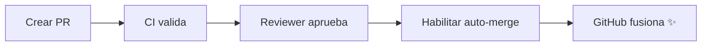

# Auto-Merge de Features Simplificado

> Estrategia de fusión automática de features usando **auto-merge nativo de GitHub** + CI/CD

## 🎯 ¿Qué es esto?

Un sistema simple para fusionar features automáticamente cuando:

- ✅ El código pasa todas las validaciones (lint, build, security)
- ✅ Un reviewer aprueba el PR
- ✅ No hay conflictos

**Sin workflows complejos. Solo GitHub nativo + CI básico.**

## ⚡ Inicio Rápido (2 minutos)

```bash
# 1. Verificar configuración
./scripts/check_repo_config.sh

# 2. Ejecutar prueba completa
./scripts/test-automerge.sh
```

El script creará un PR de prueba y habilitará auto-merge. GitHub lo fusionará automáticamente cuando pase el CI.

## 📁 Estructura

```
├── .github/workflows/ci.yml    # CI: lint, build, security
├── src/app/                    # Aplicación Next.js de ejemplo
└── scripts/
    ├── check_repo_config.sh    # Validar configuración
    └── test-automerge.sh       # Prueba automatizada
```

## 🔧 Cómo Funciona



1. **Developer** crea PR desde feature branch
2. **CI** ejecuta automáticamente validaciones
3. **Reviewer** aprueba el PR
4. **Developer/Reviewer** habilita auto-merge
5. **GitHub** fusiona cuando todos los checks pasan

## �️ Configuración Inicial (10 minutos)

### Paso 1: Habilitar Auto-Merge en GitHub

**Settings > General > Pull Requests**:

- ☑ Allow auto-merge
- ☑ Automatically delete head branches

### Paso 2: Configurar Branch Protection

**Settings > Branches > Add rule** para `main`:

```
☑ Require pull request before merging
  └─ ☑ Require approvals: 1

☑ Require status checks to pass before merging
  └─ ☑ Require branches to be up to date
  └─ Status checks: quality-gates, lint, test, security

☑ Allow auto-merge
```

> **Nota**: Los status checks aparecen después del primer CI run.

### Paso 3: Permisos de GitHub Actions

**Settings > Actions > General > Workflow permissions**:

- ☑ Read and write permissions

## 🚀 Flujo de Trabajo Completo

### Crear y fusionar una feature

```bash
# 1. Crear rama
git checkout -b feature/nueva-funcionalidad

# 2. Hacer cambios en el código
cd src/app
# ... editar archivos ...

# 3. Commit y push
git add .
git commit -m "feat: agregar nueva funcionalidad"
git push -u origin feature/nueva-funcionalidad

# 4. Crear PR en GitHub UI
# 5. Esperar que CI pase (automático)
# 6. Solicitar review
# 7. Después de aprobación, habilitar auto-merge:

gh pr merge --auto --squash <PR_NUMBER>

# 8. GitHub fusiona automáticamente cuando todo está OK ✨
```

## 🔍 Validaciones del CI

El workflow `.github/workflows/ci.yml` valida automáticamente:

| Job              | Validación                   |
| ---------------- | ---------------------------- |
| 🔍 Lint          | ESLint en código Next.js     |
| 🧪 Test          | Build de Next.js             |
| 🔒 Security      | npm audit + scan de secretos |
| ✅ Quality Gates | Resumen de validaciones      |

**Todos deben pasar** para que el auto-merge se complete.

## 💡 Comandos Útiles

```bash
# Ver PRs abiertos
gh pr list

# Ver estado de un PR
gh pr view <PR_NUMBER>

# Habilitar auto-merge
gh pr merge --auto --squash <PR_NUMBER>

# Deshabilitar auto-merge
gh pr merge --disable-auto <PR_NUMBER>

# Ver checks de CI
gh pr checks <PR_NUMBER>
```

## �️ Troubleshooting

### El auto-merge no se activa

**Verificar que**:
- ✅ Auto-merge está habilitado en Settings > General
- ✅ Branch protection configurado correctamente
- ✅ Todos los CI checks pasaron
- ✅ PR tiene aprobación requerida
- ✅ No hay conflictos de merge

```bash
# Ver estado completo del PR
gh pr view <PR_NUMBER> --json autoMergeRequest,statusCheckRollup,reviews
```

### CI falla

```bash
# Validar localmente antes de push
cd src/app
npm install
npm run lint
npm run build
```

### Auto-merge se deshabilita solo

GitHub deshabilita auto-merge cuando se pushean nuevos commits. 
**Solución**: Re-habilitarlo después del commit:

```bash
gh pr merge --auto --squash <PR_NUMBER>
```

## 📋 Buenas Prácticas

**Naming de Branches**:
- Features: `feature/descripcion-corta`
- Bugfixes: `fix/descripcion-corta`
- Docs: `docs/descripcion-corta`

**Commits**:
- Usar [conventional commits](https://www.conventionalcommits.org/):
  - `feat:` nueva funcionalidad
  - `fix:` corrección de bugs
  - `docs:` documentación
  - `refactor:` refactorización
  - `test:` tests

**Pull Requests**:
- Mantener PRs pequeños (< 400 líneas)
- Un PR = Una feature/fix
- Descripción clara del cambio
- Solicitar review temprano

**Auto-Merge**:
- Habilitar solo cuando el PR esté 100% listo
- Verificar que CI pasa localmente antes de push
- Responder a comentarios antes de fusionar

## 🔗 Recursos

- [GitHub Auto-merge Docs](https://docs.github.com/en/pull-requests/collaborating-with-pull-requests/incorporating-changes-from-a-pull-request/automatically-merging-a-pull-request)
- [Branch Protection Rules](https://docs.github.com/en/repositories/configuring-branches-and-merges-in-your-repository/managing-protected-branches)
- [GitHub Actions](https://docs.github.com/en/actions)
- [Conventional Commits](https://www.conventionalcommits.org/)

## 🎯 Qué Hace Este Sistema

✅ **CI Automático**: Valida cada PR con lint, build y security  
✅ **Auto-merge Nativo**: GitHub fusiona cuando todo está OK  
✅ **Sin Complicaciones**: No requiere workflows adicionales  
✅ **Seguro**: Multiple validaciones antes de fusionar  
✅ **Rápido**: Reduce tiempo de espera en merges  

## 📊 Comparación con Otras Estrategias

| Feature | Este Submódulo | AutoMergeFeatureManaged |
|---------|----------------|------------------------|
| Auto-merge | ✅ Nativo GitHub | ✅ Workflow custom |
| Labels automáticos | ❌ | ✅ |
| Complejidad | Baja | Media |
| Workflows extra | 1 (CI) | 3 (CI + Label + Merge) |
| Mejor para | Equipos pequeños | Equipos grandes |

## 📝 Próximos Pasos

Después de implementar esta estrategia, considera:

1. ✅ Agregar tests unitarios a la app Next.js
2. ✅ Configurar CODEOWNERS para reviews automáticos
3. ✅ Implementar feature flags
4. ✅ Agregar notificaciones (Slack/Discord)

---

**Nota**: Este es un ejemplo educativo. Para producción, asegúrate de tener una suite de tests completa.

📄 **Licencia**: MIT - Ver [LICENSE](LICENSE)
