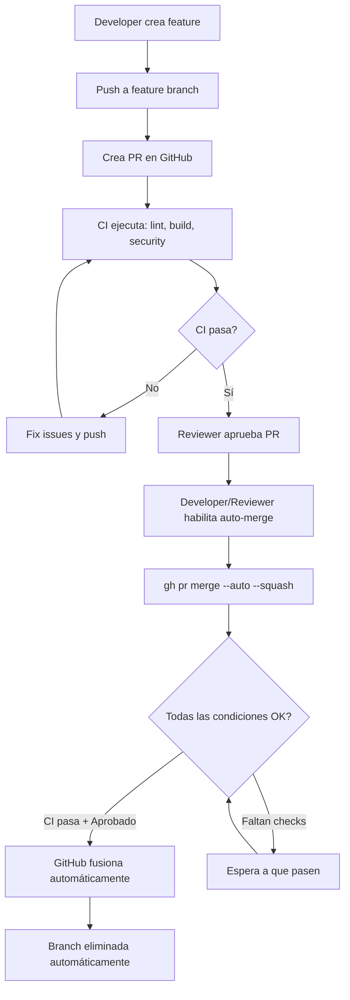

# Automerge de Features - Implementación de Ejemplo

Este submódulo contiene una implementación completa de la estrategia de **Feature AutoMerge** usando la funcionalidad nativa de auto-merge de GitHub, validada con CI/CD.

## ✅ Estado del Submódulo

- ✅ Aplicación Next.js en `/src/app`
- ✅ CI/CD configurado (`.github/workflows/ci.yml`)
- ✅ Sistema de auto-labeling (opcional)
- ✅ Scripts de validación y testing
- ✅ **Auto-merge nativo de GitHub** (no requiere workflow adicional)

## 📁 Estructura del Proyecto

```
.
├── .github/
│   ├── workflows/
│   │   ├── ci.yml                 # CI/CD para validar cambios
│   │   └── auto-label.yml         # Auto-etiquetado de PRs (opcional)
│   └── labeler.yml                # Configuración de labels
├── src/
│   └── app/                       # Aplicación Next.js de ejemplo
│       ├── app/                   # App Router de Next.js
│       ├── public/                # Archivos estáticos
│       └── package.json           # Dependencias de Next.js
├── scripts/
│   ├── check_repo_config.sh       # Validar configuración del repositorio
│   ├── create-labels.sh           # Script para crear labels en GitHub (opcional)
│   └── test-automerge.sh          # Script para ejecutar prueba completa
└── README.md
```

## 🎯 Concepto: Auto-Merge Nativo de GitHub

Esta estrategia utiliza la **funcionalidad nativa de auto-merge de GitHub**, sin necesidad de workflows adicionales:

- ✅ **Simple**: Configuración directa en GitHub Settings
- ✅ **Nativa**: Usa funcionalidad built-in de GitHub
- ✅ **Eficiente**: No consume minutos de GitHub Actions adicionales
- ✅ **Flexible**: Controlado vía Branch Protection Rules

### ¿Cómo funciona?

1. Developer crea PR y lo marca listo
2. CI ejecuta automáticamente (lint, build, security)
3. Reviewer aprueba el PR
4. Developer (o reviewer) habilita auto-merge: `gh pr merge --auto --squash <PR>`
5. **GitHub fusiona automáticamente** cuando:
   - ✅ Todos los CI checks pasan
   - ✅ Tiene aprobaciones requeridas
   - ✅ Rama está actualizada
   - ✅ No hay conflictos

## 🚀 Inicio Rápido

### Prueba Rápida (Recomendado)

Para probar el sistema de auto-merge completo de forma automatizada:

```bash
cd AutoMergeFeature

# 1. Verificar configuración del repositorio
./scripts/check_repo_config.sh

# 2. Crear labels (si no existen)
./scripts/create-labels.sh

# 3. Ejecutar test completo automatizado
./scripts/test-automerge.sh
```

El script `test-automerge.sh` hará automáticamente:

- ✅ Crear una rama de feature
- ✅ Hacer un cambio de prueba
- ✅ Crear un PR
- ✅ Esperar a que CI pase (opcional)
- ✅ Aprobar el PR automáticamente (opcional)
- ✅ **Habilitar auto-merge nativo**

**Resultado esperado**: GitHub fusionará el PR automáticamente cuando todos los checks pasen.

---

## 🚀 Guía de Implementación Paso a Paso

### 1. Configuración Inicial de GitHub (5 minutos)

#### A. Habilitar Auto-Merge

Ir a **Settings > General > Pull Requests**:

- ☑ **Allow auto-merge**
- ☑ **Automatically delete head branches** (opcional)

#### B. Permisos de GitHub Actions (solo para CI)

Ir a **Settings > Actions > General > Workflow permissions**:

- ☑ **Read and write permissions** (para que CI pueda ejecutarse)

### 2. Configurar Branch Protection (5 minutos)

**Settings > Branches > Add branch protection rule**:

Para `main`:

```
Branch name pattern: main

☑ Require a pull request before merging
  ☑ Require approvals: 1
  ☐ Dismiss stale reviews when new commits are pushed (opcional)
  ☑ Require review from Code Owners (opcional)

☑ Require status checks to pass before merging
  ☑ Require branches to be up to date before merging

  Status checks required (agregar después del primer CI run):
  - 🧪 Run Tests
  - 🔍 Lint
  - 🔒 Security Scan
  - ✅ Quality Gates

☑ Require conversation resolution before merging
☑ Allow auto-merge
☑ Automatically delete head branches

☐ Require linear history (opcional)
☐ Require signed commits (opcional)
```

**⚠️ Nota**: Los status checks aparecerán disponibles solo después de ejecutar los workflows por primera vez.

### 4. Primera Prueba - Feature con AutoMerge (10 minutos)

#### Paso 1: Crear rama de feature

```bash
git checkout main
git pull origin main
git checkout -b feature/test-automerge
```

#### Paso 2: Hacer un cambio en Next.js

```bash
cd src/app/app

# Crear nuevo archivo de features
cat > features.ts << 'EOF'
// Feature flags para testing de automerge
export const FEATURES = {
  autoMergeEnabled: true,
  testFeature: {
    name: 'Test AutoMerge',
    enabled: true,
    description: 'Feature para validar el sistema de automerge',
  },
} as const;
EOF

cd ../../..
```

#### Paso 3: Commit y push

```bash
git add .
git commit -m "feat: Add feature flags for automerge testing"
git push -u origin feature/test-automerge
```

#### Paso 4: Crear Pull Request en GitHub

1. Ir a GitHub
2. Crear PR: `feature/test-automerge` → `main`
3. Título: `feat: Add feature flags for automerge testing`
4. Descripción:

```markdown
## 🎯 Propósito

Agregar feature flags para probar el sistema de automerge

## ✅ Cambios

- Nuevo archivo `features.ts` con configuración de features

## 🧪 Testing

- Build de Next.js pasa
- Linter pasa
```

#### Paso 5: Observar el Auto-Labeling

Después de crear el PR, observa:

- Se aplicará automáticamente el label `size/xs` o `size/s`
- Si modificaste archivos `.md`, tendrá `documentation`
- Si modificaste `package.json`, tendrá `dependencies`

#### Paso 6: Esperar CI y Aprobar

1. Espera que pasen todos los CI checks (2-3 minutos)
2. Un reviewer aprueba el PR
3. **Agrega el label `ready-to-merge`** manualmente

#### Paso 7: Observar el AutoMerge

1. Ve a **Actions** en GitHub
2. Se ejecutará `✨ Feature Auto-Merge`
3. El workflow:
   - Esperará a que pasen todos los checks
   - Verificará que tenga 1+ aprobación
   - Habilitará auto-merge automáticamente
4. El PR se fusionará automáticamente cuando esté listo

### 5. Validar el CI (Opcional)

Para verificar que el CI funciona localmente:

```bash
cd src/app

# Instalar dependencias
npm install

# Ejecutar linter
npm run lint

# Build de Next.js
npm run build

# Iniciar en desarrollo
npm run dev
```

## 🔄 Cómo Funciona

### Auto-Merge Nativo de GitHub

Esta implementación usa la **funcionalidad nativa de auto-merge de GitHub** (no requiere workflows adicionales):

- **Activación**: Comando manual o desde UI:
  ```bash
  gh pr merge --auto --squash <PR_NUMBER>
  ```
- **Branch Protection Rules** controlan las condiciones:
  - PR debe pasar todos los status checks requeridos
  - PR debe tener el número de aprobaciones configurado
  - Rama debe estar actualizada (opcional)
- **Proceso Automático**:
  1. Developer o reviewer habilita auto-merge
  2. GitHub espera que se cumplan las condiciones
  3. Cuando status checks pasan + tiene aprobaciones → **merge automático**
  4. GitHub elimina la rama automáticamente (si está configurado)

### Workflow de CI (`ci.yml`)

- **Validaciones**:
  - **Lint**: ESLint en la aplicación Next.js
  - **Build**: Compilación de Next.js
  - **Security**: Audit de npm + scan de secretos
- **Optimizaciones**:
  - Cache de dependencias
  - Cancelación de runs previos del mismo PR
  - Ejecución en paralelo de jobs

### Comandos Útiles

```bash
# Ver PRs abiertos
gh pr list

# Ver estado de un PR
gh pr view <PR_NUMBER>

# Ver checks de un PR
gh pr checks <PR_NUMBER>

# ⭐ Habilitar auto-merge en un PR
gh pr merge --auto --squash <PR_NUMBER>

# Deshabilitar auto-merge
gh pr merge --disable-auto <PR_NUMBER>

# Ver workflows de CI ejecutados
gh run list --workflow="CI Tests"

# Ver logs de un workflow
gh run view <RUN_ID> --log

# Ver detalles completos de un PR (incluyendo auto-merge status)
gh pr view <PR_NUMBER> --json labels,reviews,statusCheckRollup,autoMergeRequest
```

## 📊 Diagrama de Flujo



## 🛠️ Troubleshooting

### El auto-merge no funciona

**Verificar Branch Protection Rules**:

1. Ir a **Settings > Branches**
2. Verificar que `main` tiene:
   - ✅ "Require status checks to pass"
   - ✅ Status checks seleccionados: `quality-gates`, `lint`, `test`, `security`
   - ✅ "Require approvals" (1 mínimo)
3. Verificar que "Allow auto-merge" está habilitado en Settings > General

```bash
# Ver configuración actual del PR
gh pr view <PR_NUMBER> --json autoMergeRequest,statusCheckRollup,reviews

# Ver si auto-merge está habilitado
gh pr view <PR_NUMBER> --json autoMergeRequest
```

**Causas comunes**:

- Branch protection rules no configuradas correctamente
- CI checks aún corriendo o fallaron
- No tiene aprobaciones suficientes
- Rama desactualizada (si se requiere estar up-to-date)
- Auto-merge no fue habilitado con `gh pr merge --auto`

### CI falla en Next.js build

```bash
# Verificar localmente
cd src/app
npm install
npm run lint
npm run build
```

### Auto-merge se deshabilita solo

Esto ocurre cuando:

- Se pushean nuevos commits (GitHub deshabilita auto-merge por seguridad)
- **Solución**: Volver a habilitar después del commit:
  ```bash
  gh pr merge --auto --squash <PR_NUMBER>
  ```

### No aparecen los status checks en branch protection

1. Haz al menos un commit y PR para que se ejecuten los workflows
2. Después de la primera ejecución, los checks aparecerán en la lista
3. Selecciónalos en Branch Protection

## 🏷️ Sistema de Labels (Opcional)

> **Nota**: Los labels NO son necesarios para el auto-merge nativo de GitHub.
> Se pueden usar opcionalmente para organización del proyecto.

### Labels Sugeridos (Opcional)

| Label             | Color                  | Propósito                    |
| ----------------- | ---------------------- | ---------------------------- |
| `breaking-change` | Rojo oscuro (`d73a4a`) | Marca cambios que rompen API |
| `needs-review`    | Amarillo (`fbca04`)    | Requiere revisión adicional  |
| `documentation`   | Azul (`0075ca`)        | Cambios en documentación     |
| `dependencies`    | Verde (`0e8a16`)       | Actualizaciones de deps      |

Si deseas usar auto-labeling automático, puedes configurar el workflow `auto-label.yml` (ver submódulo `AutoMergeFeatureManaged`).

## 🔐 Seguridad

### Validaciones Pre-Merge

El CI ejecuta automáticamente:

1. **ESLint**: Valida calidad de código
2. **Build**: Asegura que el código compila
3. **npm audit**: Detecta vulnerabilidades en dependencias
4. **TruffleHog**: Escanea secretos hardcodeados

### Condiciones para Auto-Merge Nativo

El auto-merge se completa automáticamente cuando:

- ✅ Status checks configurados en Branch Protection **pasan** (`quality-gates`, `lint`, `test`, `security`)
- ✅ PR tiene el número de **aprobaciones requeridas** (configurado en Branch Protection)
- ✅ Rama está **actualizada** con base (si se requiere en Branch Protection)
- ✅ No hay **conflictos** de merge
- ✅ PR **no es draft**

Configurado en: **Settings > Branches > Branch protection rules**

## 📊 Ejemplo de Flujo Completo

```bash
# 1. Crear feature
git checkout main
git pull
git checkout -b feature/user-dashboard

# 2. Desarrollar feature
cd src/app
# ... hacer cambios ...
cd ../..

git add .
git commit -m "feat: Add user dashboard component"
git push -u origin feature/user-dashboard

# 3. Crear PR en GitHub
# 4. CI valida automáticamente
# 5. Reviewer aprueba
# 6. Agregar label "ready-to-merge"
# 7. Automerge se habilita automáticamente
# 8. PR se fusiona cuando todos los checks pasen
```

## 🛠️ Troubleshooting

### El automerge no se activa

**Verificar**:

````bash
# Ver labels del PR
gh pr view <PR_NUMBER> --json labels

# Ver estado de checks
gh 🎯 Resultado Esperado

Después de completar la implementación:

1. ✅ Tendrás todos los labels configurados
2. ✅ Branch protection configurado en `main`
3. ✅ Los PRs se auto-etiquetarán por tamaño y tipo
4. ✅ Los PRs con label `ready-to-merge` se fusionarán automáticamente
5. ✅ El CI validará lint, build y security en cada PR

## 🔗 Recursos

- [Documentación completa](../../docs/FeatureAutoMerge.md)
- [GitHub Auto-merge](https://docs.github.com/en/pull-requests/collaborating-with-pull-requests/incorporating-changes-from-a-pull-request/automatically-merging-a-pull-request)
- [Branch Protection](https://docs.github.com/en/repositories/configuring-branches-and-merges-in-your-repository/managing-protected-branches)
- [GitHub Actions Labeler](https://github.com/actions/labeler)

## 🎉 Próximos Pasos Sugeridos

- Configurar CODEOWNERS para reviews automáticos
- Agregar tests unitarios a la aplicación Next.js
- Configurar notificaciones de Slack para merges
- Implementar feature flags en la aplicación

**Causas comunes**:
- Falta el label `ready-to-merge`
- Tiene el label `do-not-merge`
- CI checks fallaron
- No tiene aprobaciones

### CI falla en Next.js build

```bash
# Verificar localmente
cd src/app
npm install
npm run lint
npm run build
````

### Conflictos de Merge

Si hay conflictos, el automerge NO se ejecutará. Resolver manualmente:

```bash
git checkout feature/mi-feature
git fetch origin
git merge origin/main
# Resolver conflictos
git add .
git commit
git push
```

## 📝 Buenas Prácticas

1. **Naming Conventions**:
   - Features: `feature/descripcion-corta`
   - Bugfixes: `fix/descripcion-corta`
   - Docs: `docs/descripcion-corta`

2. **PR Size**:
   - Mantener PRs pequeños (< 400 líneas)
   - Un PR = Una feature/fix

3. **Commits**:
   - Usar conventional commits: `feat:`, `fix:`, `docs:`, etc.

4. **Labels**:
   - Agregar `ready-to-merge` solo cuando esté 100% listo
   - Usar `do-not-merge` si necesitas más tiempo

5. **Reviews**:
   - Solicitar reviews tempranas para feedback rápido
   - Responder a comentarios antes de marcar como ready

## 🔗 Recursos

- [Documentación completa](../../docs/FeatureAutoMerge.md)
- [GitHub Auto-merge](https://docs.github.com/en/pull-requests/collaborating-with-pull-requests/incorporating-changes-from-a-pull-request/automatically-merging-a-pull-request)
- [Branch Protection](https://docs.github.com/en/repositories/configuring-branches-and-merges-in-your-repository/managing-protected-branches)

## 📄 Licencia

MIT - Ver [LICENSE](LICENSE)

---

**Nota**: Este es un ejemplo educativo. Asegúrate de tener una suite de tests robusta antes de usar automerge en producción.
