# Automerge de Features - Implementación de Ejemplo

Este submódulo contiene una implementación completa de la estrategia de **Feature AutoMerge** usando GitHub Actions y labels.

## ✅ Estado del Submódulo

- ✅ Aplicación Next.js en `/src/app`
- ✅ Workflows de GitHub Actions (`.github/workflows/`)
- ✅ Sistema de auto-labeling
- ✅ Script de creación de labels
- ✅ CI configurado para validar Next.js

## 📁 Estructura del Proyecto

```
.
├── .github/
│   ├── workflows/
│   │   ├── feature-automerge.yml  # Workflow principal de automerge
│   │   ├── ci.yml                 # CI/CD para validar cambios
│   │   └── auto-label.yml         # Auto-etiquetado de PRs
│   └── labeler.yml                # Configuración de labels
├── src/
│   └── app/                       # Aplicación Next.js de ejemplo
│       ├── app/                   # App Router de Next.js
│       ├── public/                # Archivos estáticos
│       └── package.json           # Dependencias de Next.js
├── scripts/
│   └── create-labels.sh           # Script para crear labels en GitHub
└── README.md
```

## 🚀 Guía de Implementación Paso a Paso

### 1. Configuración Inicial de GitHub (5 minutos)

#### A. Habilitar Auto-Merge

Ir a **Settings > General > Pull Requests**:
- ☑ **Allow auto-merge**

#### B. Permisos de GitHub Actions

Ir a **Settings > Actions > General > Workflow permissions**:
- ☑ **Read and write permissions**
- ☑ **Allow GitHub Actions to create and approve pull requests**

### 2. Crear Labels (2 minutos)

Ejecutar desde el directorio del submódulo:

```bash
cd AutoMergeFeature
./scripts/create-labels.sh
```

Esto creará automáticamente:

**Labels de Control**:
- `ready-to-merge` (verde) - Habilita automerge
- `do-not-merge` (rojo) - Bloquea automerge
- `breaking-change` (rojo oscuro) - Cambios que rompen API
- `needs-review` (amarillo) - Requiere revisión adicional

**Labels Automáticos**:
- `documentation`, `dependencies`, `ci/cd`, `frontend`, `config`
- `size/xs`, `size/s`, `size/m`, `size/l`, `size/xl`

O créalos manualmente con `gh` CLI:

```bash
gh label create "ready-to-merge" --color "0e8a16" --description "Ready for automatic merge"
gh label create "do-not-merge" --color "b60205" --description "Block automatic merge"
gh label create "breaking-change" --color "d73a4a" --description "Breaking changes"
gh label create "needs-review" --color "fbca04" --description "Requires additional review"
```

### 3. Configurar Branch Protection (5 minutos)

**Settings > Branches > Add branch protection rule**:

Para `main`:
```
Branch name pattern: main

☑ Require a pull request before merging
  ☑ Require approvals: 1
  ☐ Dismiss stale reviews when new commits are pushed (opcional)
  ☑ Require review from Code Owners (opcional)

☑ Require status checks to pass before merging
  ☑ Require branches to be up to date before merging
  
  Status checks required (agregar después del primer CI run):
  - 🧪 Run Tests
  - 🔍 Lint
  - 🔒 Security Scan
  - ✅ Quality Gates

☑ Require conversation resolution before merging
☑ Allow auto-merge
☑ Automatically delete head branches

☐ Require linear history (opcional)
☐ Require signed commits (opcional)
```

**⚠️ Nota**: Los status checks aparecerán disponibles solo después de ejecutar los workflows por primera vez.

### 4. Primera Prueba - Feature con AutoMerge (10 minutos)

#### Paso 1: Crear rama de feature

```bash
git checkout main
git pull origin main
git checkout -b feature/test-automerge
```

#### Paso 2: Hacer un cambio en Next.js

```bash
cd src/app/app

# Crear nuevo archivo de features
cat > features.ts << 'EOF'
// Feature flags para testing de automerge
export const FEATURES = {
  autoMergeEnabled: true,
  testFeature: {
    name: 'Test AutoMerge',
    enabled: true,
    description: 'Feature para validar el sistema de automerge',
  },
} as const;
EOF

cd ../../..
```

#### Paso 3: Commit y push

```bash
git add .
git commit -m "feat: Add feature flags for automerge testing"
git push -u origin feature/test-automerge
```

#### Paso 4: Crear Pull Request en GitHub

1. Ir a GitHub
2. Crear PR: `feature/test-automerge` → `main`
3. Título: `feat: Add feature flags for automerge testing`
4. Descripción:
```markdown
## 🎯 Propósito
Agregar feature flags para probar el sistema de automerge

## ✅ Cambios
- Nuevo archivo `features.ts` con configuración de features

## 🧪 Testing
- Build de Next.js pasa
- Linter pasa
```

#### Paso 5: Observar el Auto-Labeling

Después de crear el PR, observa:
- Se aplicará automáticamente el label `size/xs` o `size/s`
- Si modificaste archivos `.md`, tendrá `documentation`
- Si modificaste `package.json`, tendrá `dependencies`

#### Paso 6: Esperar CI y Aprobar

1. Espera que pasen todos los CI checks (2-3 minutos)
2. Un reviewer aprueba el PR
3. **Agrega el label `ready-to-merge`** manualmente

#### Paso 7: Observar el AutoMerge

1. Ve a **Actions** en GitHub
2. Se ejecutará `✨ Feature Auto-Merge`
3. El workflow:
   - Esperará a que pasen todos los checks
   - Verificará que tenga 1+ aprobación
   - Habilitará auto-merge automáticamente
4. El PR se fusionará automáticamente cuando esté listo

### 5. Validar el CI (Opcional)

Para verificar que el CI funciona localmente:

```bash
cd src/app

# Instalar dependencias
npm install

# Ejecutar linter
npm run lint

# Build de Next.js
npm run build

# Iniciar en desarrollo
npm run dev
```

## 🔄 Cómo Funciona

### Workflow de Auto-Merge (`feature-automerge.yml`)

- **Trigger**: Se ejecuta cuando:
  - Se agrega/quita un label
  - Se sincroniza el PR (nuevos commits)
  - Se marca como ready for review
  
- **Condiciones**:
  - PR no es draft
  - Tiene el label `ready-to-merge`
  - NO tiene el label `do-not-merge`
  
- **Proceso**:
  1. Espera a que pasen todos los CI checks
  2. Verifica que tenga al menos 1 aprobación
  3. Habilita auto-merge con estrategia squash

### Workflow de CI (`ci.yml`)

- **Validaciones**:
  - **Lint**: ESLint en la aplicación Next.js
  - **Build**: Compilación de Next.js
  - **Security**: Audit de npm + scan de secretos
  
- **Optimizaciones**:
  - Cache de dependencias
  - Cancelación de runs previos del mismo PR
  - Ejecución en paralelo de jobs

### � Comandos Útiles

```bash
# Ver labels del repositorio
gh label list

# Ver PRs abiertos
gh pr list

# Ver estado de un PR
gh pr view <PR_NUMBER>

# Ver checks de un PR
gh pr checks <PR_NUMBER>

# Agregar label a un PR
gh pr edit <PR_NUMBER> --add-label "ready-to-merge"

# Ver workflows ejecutados
gh run list --workflow="Feature Auto-Merge"

# Ver logs de un workflow
gh run view <RUN_ID> --log

# Ver detalles completos de un PR
gh pr view <PR_NUMBER> --json labels,reviews,statusCheckRollup
```

## 📊 Diagrama de Flujo

```mermaid
graph TD
    A[Desarrollador crea feature] --> B[Push a feature branch]
    B --> C[Crea PR en GitHub]
    C --> D[CI ejecuta: lint, build, security]
    D --> E{CI pasa?}
    E -->|No| F[Fix issues y push]
    F --> D
    E -->|Sí| G[Auto-labeling se aplica]
    G --> H[Reviewer aprueba]
    H --> I[Developer agrega ready-to-merge]
    I --> J[AutoMerge workflow se ejecuta]
    J --> K{Tiene aprobación?}
    K -->|No| L[Espera aprobación]
    K -->|Sí| M[Habilita auto-merge]
    M --> N[PR se fusiona automáticamente]
```



## 🛠️ Troubleshooting

### El automerge no se habilita

**Verificar**:
1. PR tiene label `ready-to-merge`
2. PR NO tiene label `do-not-merge`
3. PR no es draft
4. Todos los CI checks pasan
5. PR tiene al menos 1 aprobación

```bash
gh pr view <PR_NUMBER> --json labels,reviews,statusCheckRollup
```

**Causas comunes**:
- Falta el label `ready-to-merge`
- Tiene el label `do-not-merge`
- CI checks fallaron
- No tiene aprobaciones

### CI falla en Next.js build

```bash
# Verificar localmente
cd src/app
npm install
npm run lint
npm run build
```

### Labels no se aplican automáticamente

- Verificar que el workflow `auto-label.yml` esté activo
- Verificar que `.github/labeler.yml` tiene las rutas correctas
- Ver logs del workflow en Actions

### No aparecen los checks requeridos en branch protection

1. Haz al menos un commit y PR para que se ejecuten los workflows
2. Después de la primera ejecución, los checks aparecerán en la lista
3. Selecciónalos en Branch Protection

## 🏷️ Sistema de Labels

### Labels de Control de Merge

| Label | Color | Propósito |
|-------|-------|-----------|
| `ready-to-merge` | Verde (`0e8a16`) | Habilita automerge |
| `do-not-merge` | Rojo (`b60205`) | Bloquea automerge |
| `breaking-change` | Rojo oscuro (`d73a4a`) | Marca cambios que rompen API |
| `needs-review` | Amarillo (`fbca04`) | Requiere revisión adicional |

### Labels Automáticos

| Label | Cuándo se aplica |
|-------|------------------|
| `documentation` | Cambios en archivos `.md` |
| `dependencies` | Cambios en `package.json` |
| `ci/cd` | Cambios en workflows |
| `frontend` | Cambios en componentes |
| `size/*` | Según cantidad de líneas cambiadas |

## 🔐 Seguridad

### Validaciones Pre-Merge

El CI ejecuta:

1. **ESLint**: Valida calidad de código
2. **Build**: Asegura que el código compila
3. **npm audit**: Detecta vulnerabilidades en dependencias
4. **TruffleHog**: Escanea secretos hardcodeados

### Condiciones de Automerge

El automerge SOLO se activa si:
- ✅ PR tiene label `ready-to-merge`
- ✅ PR NO tiene label `do-not-merge`
- ✅ PR no es draft
- ✅ Todos los CI checks pasan
- ✅ Tiene al menos 1 aprobación
- ✅ No hay conflictos de merge

## 📊 Ejemplo de Flujo Completo

```bash
# 1. Crear feature
git checkout main
git pull
git checkout -b feature/user-dashboard

# 2. Desarrollar feature
cd src/app
# ... hacer cambios ...
cd ../..

git add .
git commit -m "feat: Add user dashboard component"
git push -u origin feature/user-dashboard

# 3. Crear PR en GitHub
# 4. CI valida automáticamente
# 5. Reviewer aprueba
# 6. Agregar label "ready-to-merge"
# 7. Automerge se habilita automáticamente
# 8. PR se fusiona cuando todos los checks pasen
```

## 🛠️ Troubleshooting

### El automerge no se activa

**Verificar**:

```bash
# Ver labels del PR
gh pr view <PR_NUMBER> --json labels

# Ver estado de checks
gh 🎯 Resultado Esperado

Después de completar la implementación:

1. ✅ Tendrás todos los labels configurados
2. ✅ Branch protection configurado en `main`
3. ✅ Los PRs se auto-etiquetarán por tamaño y tipo
4. ✅ Los PRs con label `ready-to-merge` se fusionarán automáticamente
5. ✅ El CI validará lint, build y security en cada PR

## 🔗 Recursos

- [Documentación completa](../../docs/FeatureAutoMerge.md)
- [GitHub Auto-merge](https://docs.github.com/en/pull-requests/collaborating-with-pull-requests/incorporating-changes-from-a-pull-request/automatically-merging-a-pull-request)
- [Branch Protection](https://docs.github.com/en/repositories/configuring-branches-and-merges-in-your-repository/managing-protected-branches)
- [GitHub Actions Labeler](https://github.com/actions/labeler)

## 🎉 Próximos Pasos Sugeridos

- Configurar CODEOWNERS para reviews automáticos
- Agregar tests unitarios a la aplicación Next.js
- Configurar notificaciones de Slack para merges
- Implementar feature flags en la aplicación

**Causas comunes**:
- Falta el label `ready-to-merge`
- Tiene el label `do-not-merge`
- CI checks fallaron
- No tiene aprobaciones

### CI falla en Next.js build

```bash
# Verificar localmente
cd src/app
npm install
npm run lint
npm run build
```

### Conflictos de Merge

Si hay conflictos, el automerge NO se ejecutará. Resolver manualmente:

```bash
git checkout feature/mi-feature
git fetch origin
git merge origin/main
# Resolver conflictos
git add .
git commit
git push
```

## 📝 Buenas Prácticas

1. **Naming Conventions**:
   - Features: `feature/descripcion-corta`
   - Bugfixes: `fix/descripcion-corta`
   - Docs: `docs/descripcion-corta`

2. **PR Size**:
   - Mantener PRs pequeños (< 400 líneas)
   - Un PR = Una feature/fix

3. **Commits**:
   - Usar conventional commits: `feat:`, `fix:`, `docs:`, etc.

4. **Labels**:
   - Agregar `ready-to-merge` solo cuando esté 100% listo
   - Usar `do-not-merge` si necesitas más tiempo

5. **Reviews**:
   - Solicitar reviews tempranas para feedback rápido
   - Responder a comentarios antes de marcar como ready

## 🔗 Recursos

- [Documentación completa](../../docs/FeatureAutoMerge.md)
- [GitHub Auto-merge](https://docs.github.com/en/pull-requests/collaborating-with-pull-requests/incorporating-changes-from-a-pull-request/automatically-merging-a-pull-request)
- [Branch Protection](https://docs.github.com/en/repositories/configuring-branches-and-merges-in-your-repository/managing-protected-branches)

## 📄 Licencia

MIT - Ver [LICENSE](LICENSE)

---

**Nota**: Este es un ejemplo educativo. Asegúrate de tener una suite de tests robusta antes de usar automerge en producción.
